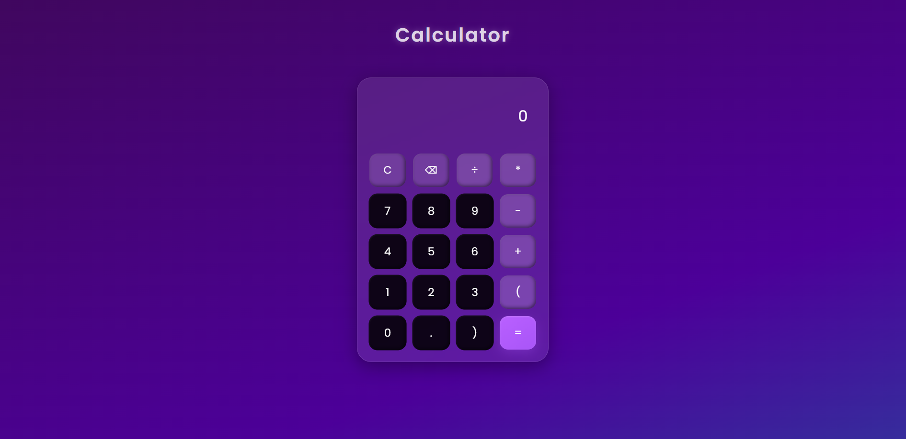

# Calculator

A stylish calculator built with **HTML, CSS, and JavaScript** featuring a modern **glassmorphism UI** design.

# Features
- Frosted glass effect using CSS `backdrop-filter`
- Responsive design with grid layout
- Animated gradient background
- Functional calculator logic in JS

# Preview

# How to Use
1. Clone the repository or download ZIP.
2. Open `index.html` in your browser.

